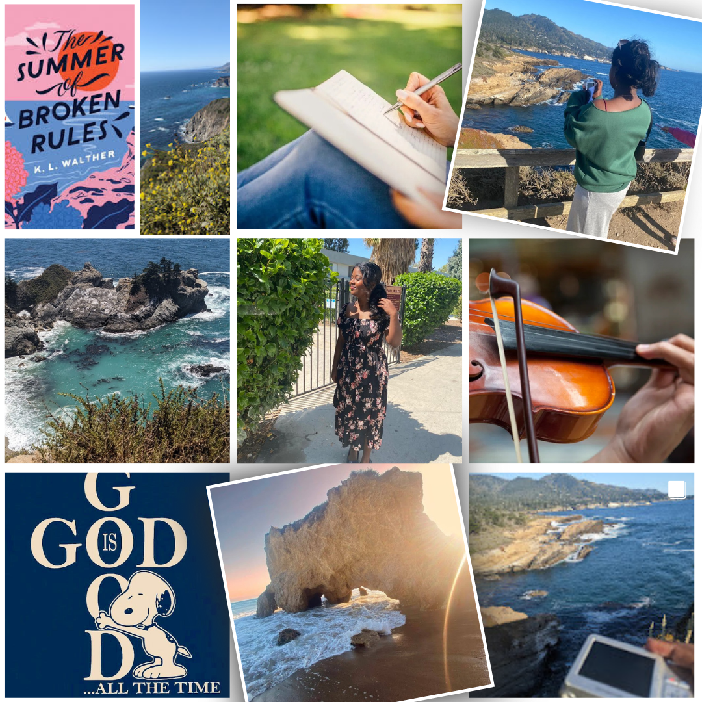

# Me in Markdown

## Introduction

Hi, My name is Serah! I am in tenth grade at Chatsworth Charter High School. This year I am taking AP computer science A, AP Seminar, Honors Chemistry, Honors Advanced Math, Leadership, and cross country. Over the summer I went to many beaches. The most interesting and pretty beachers were El Matador Beach near Malibu, and the Purple sand beach in Big Sur.

Some of my hobbies include reading, writing, playing the violin, playing the viola, crocheting, sewing, baking/cooking, and volunteering at the library. My favorite book is Love and Gelato, I think my favorite genre for both movies and books are rom-com or thriller style. I really enjoy writing so I am trying to develop a story. I also have a christian podcast, where I enjoy talking about how both science and christianity are related.

I am an active volunteer at Chatsworth library. I really enjoy working and helping out at the library, we are currently teaching a crochet workshop along with a crochet circle. I also taught how to self-publish crash course at the library as well. One of my favorite activities we did was for the Chatsworth Holiday Parade where we made book costumes and did the parade and the book titles spelled out our Chatsworth. 

## My Playlist

[This is my spotify playlist! ](https://open.spotify.com/playlist/4PVFgu9Lb8lOJOujDgyOVi?si=b4b90fcd83d44b1c&pt=0c668fa668a6d8867d2b53f7e8169d91)

## Collage/Moodboard

